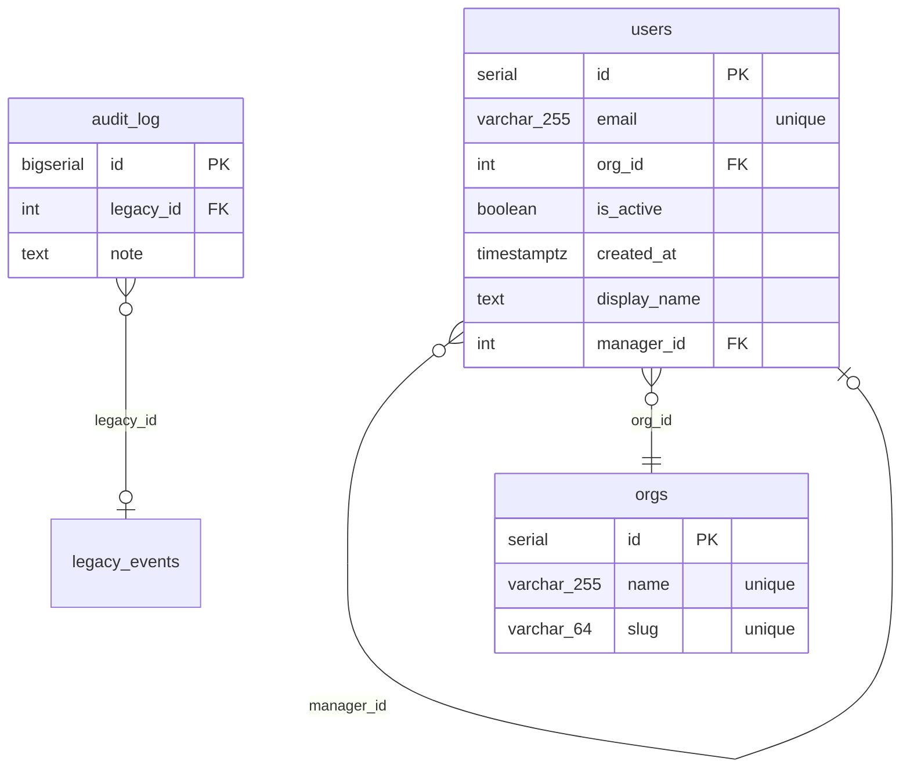

# Schema

_Generated by stratum on 2026-07-04T16:54:59Z from `testdata/migrations`._

## Tables

- [audit_log](#audit_log)
- [orgs](#orgs)
- [users](#users)

## ERD

## audit_log

### Columns

| Name | Type | Nullable | Default | Constraints |
| --- | --- | --- | --- | --- |
| id | `bigserial` | no |  | PK |
| legacy_id | `int` | yes |  | FK |
| note | `text` | yes |  |  |

### Foreign Keys

| Name | Columns | References |
| --- | --- | --- |
| — | legacy_id | legacy_events (id) |

## orgs

### Columns

| Name | Type | Nullable | Default | Constraints |
| --- | --- | --- | --- | --- |
| id | `serial` | no |  | PK |
| name | `varchar(255)` | no |  | unique |
| slug | `varchar(64)` | yes |  | unique |

### Indexes

| Name | Columns | Unique |
| --- | --- | --- |
| — | slug | yes |
| uq_orgs_name | name | yes |

## users

### Columns

| Name | Type | Nullable | Default | Constraints |
| --- | --- | --- | --- | --- |
| id | `serial` | no |  | PK |
| email | `varchar(255)` | no |  | unique |
| org_id | `int` | no |  | FK |
| is_active | `boolean` | no | `true` |  |
| created_at | `timestamptz` | yes | `now()` |  |
| display_name | `text` | yes |  |  |
| manager_id | `int` | yes |  | FK |

### Indexes

| Name | Columns | Unique |
| --- | --- | --- |
| — | email | yes |
| idx_users_org_id | org_id | no |
| uq_users_email | email | yes |

### Foreign Keys

| Name | Columns | References |
| --- | --- | --- |
| — | org_id | orgs (id) |
| fk_users_manager | manager_id | users (id) |

### Checks

- `email <> ''`

