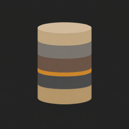
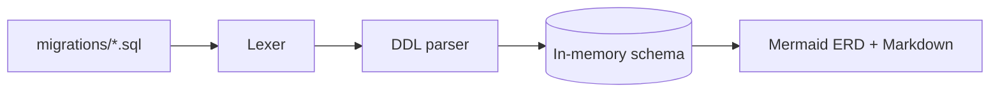

---
hide:
  - navigation
  - toc
---

<div class="hero" markdown>

{ .hero-logo }

# stratum

<p class="hero-tagline">Static PostgreSQL migrations → Mermaid ERD.<br>No database, no cgo, no network.</p>

[Get started](usage.md){ .md-button .md-button--primary }
[See a live ERD](example.md){ .md-button }

</div>

<div class="grid cards" markdown>

-   :material-database-off-outline:{ .lg .middle } __No database__

    ---

    Replays your migrations against an in-memory model. Nothing to provision,
    seed or tear down in CI.

-   :material-language-go:{ .lg .middle } __Pure Go, one binary__

    ---

    A hand-written DDL parser with no cgo and no third-party SQL library.
    `CGO_ENABLED=0` just works.

-   :material-check-decagram-outline:{ .lg .middle } __Deterministic__

    ---

    The same migrations always render the same document, which is what makes
    the [`--check` CI gate](usage.md#keeping-docs-fresh-in-ci) possible.

-   :material-github:{ .lg .middle } __Built for CI__

    ---

    Ships as a [GitHub Action](github-action.md): push regenerated docs, or
    fail the pull request when they're stale.

</div>

## How it works



Migrations are applied in order, so `ALTER`, `RENAME` and `DROP` behave like
they do in a real database: the diagram shows the schema as it exists after
the last migration. Statements the parser doesn't model (DML, `DO` blocks,
functions) are skipped, never fatal. See [Parser](parser.md) for the details.

## Quick start

=== "CLI"

    ```bash
    go install github.com/zvdy/stratum/cmd/stratum@latest
    stratum --migrations-path db/migrations --output SCHEMA.md
    ```

=== "GitHub Action"

    ```yaml
    - uses: actions/checkout@v4
    - uses: zvdy/stratum@main
      with:
        migrations-path: db/migrations
        output: SCHEMA.md
        check: "true"
    ```

=== "Docker"

    ```bash
    docker build -t stratum .
    docker run --rm -v "$PWD:/work" -w /work stratum \
      --migrations-path db/migrations --output SCHEMA.md
    ```

!!! tip "See it in action"
    The [live example](example.md) is generated by stratum itself, from this
    repository's test migrations, every time the site deploys.
