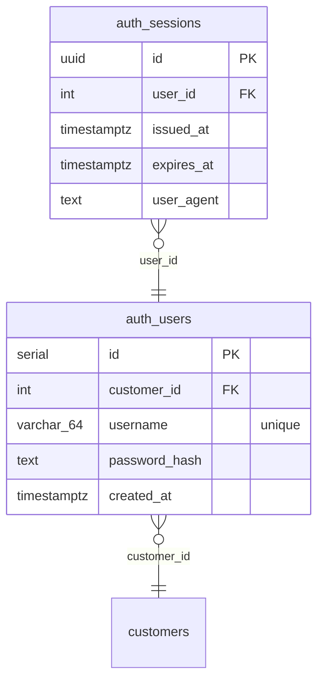

# Schema

_Generated by stratum on 2026-06-22T19:53:09Z from `examples/ecommerce/migrations`._

## Tables

- [auth_sessions](#auth-sessions)
- [auth_users](#auth-users)

## ERD

## auth_sessions

### Columns

| Name | Type | Nullable | Default | Constraints |
| --- | --- | --- | --- | --- |
| id | `uuid` | no |  | PK |
| user_id | `int` | no |  | FK |
| issued_at | `timestamptz` | no | `now()` |  |
| expires_at | `timestamptz` | no |  |  |
| user_agent | `text` | yes |  |  |

### Indexes

| Name | Columns | Unique |
| --- | --- | --- |
| idx_sessions_user | user_id | no |

### Foreign Keys

| Name | Columns | References |
| --- | --- | --- |
| — | user_id | auth_users (id) |

## auth_users

### Columns

| Name | Type | Nullable | Default | Constraints |
| --- | --- | --- | --- | --- |
| id | `serial` | no |  | PK |
| customer_id | `int` | yes |  | FK |
| username | `varchar(64)` | no |  | unique |
| password_hash | `text` | no |  |  |
| created_at | `timestamptz` | no | `now()` |  |

### Indexes

| Name | Columns | Unique |
| --- | --- | --- |
| — | username | yes |

### Foreign Keys

| Name | Columns | References |
| --- | --- | --- |
| fk_users_customer | customer_id | customers (id) |

