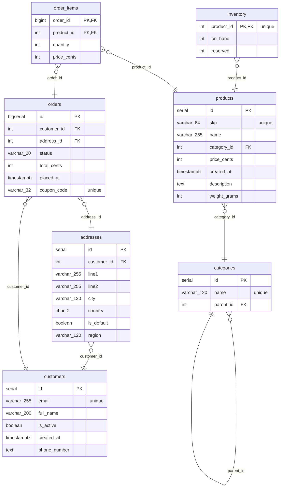

# Schema

_Generated by stratum on 2026-06-22T19:53:09Z from `examples/ecommerce/migrations`._

## Tables

- [addresses](#addresses)
- [categories](#categories)
- [customers](#customers)
- [inventory](#inventory)
- [order_items](#order-items)
- [orders](#orders)
- [products](#products)

## ERD

## addresses

### Columns

| Name | Type | Nullable | Default | Constraints |
| --- | --- | --- | --- | --- |
| id | `serial` | no |  | PK |
| customer_id | `int` | no |  | FK |
| line1 | `varchar(255)` | no |  |  |
| line2 | `varchar(255)` | yes |  |  |
| city | `varchar(120)` | no |  |  |
| country | `char(2)` | no |  |  |
| is_default | `boolean` | no | `false` |  |
| region | `varchar(120)` | yes |  |  |

### Foreign Keys

| Name | Columns | References |
| --- | --- | --- |
| — | customer_id | customers (id) |

## categories

### Columns

| Name | Type | Nullable | Default | Constraints |
| --- | --- | --- | --- | --- |
| id | `serial` | no |  | PK |
| name | `varchar(120)` | no |  | unique |
| parent_id | `int` | yes |  | FK |

### Indexes

| Name | Columns | Unique |
| --- | --- | --- |
| — | name | yes |

### Foreign Keys

| Name | Columns | References |
| --- | --- | --- |
| — | parent_id | categories (id) |

## customers

### Columns

| Name | Type | Nullable | Default | Constraints |
| --- | --- | --- | --- | --- |
| id | `serial` | no |  | PK |
| email | `varchar(255)` | no |  | unique |
| full_name | `varchar(200)` | no |  |  |
| is_active | `boolean` | no | `true` |  |
| created_at | `timestamptz` | no | `now()` |  |
| phone_number | `text` | yes |  |  |

### Indexes

| Name | Columns | Unique |
| --- | --- | --- |
| — | email | yes |

### Checks

- `email <> ''`

## inventory

### Columns

| Name | Type | Nullable | Default | Constraints |
| --- | --- | --- | --- | --- |
| product_id | `int` | no |  | PK, FK, unique |
| on_hand | `int` | no | `0` |  |
| reserved | `int` | no | `0` |  |

### Indexes

| Name | Columns | Unique |
| --- | --- | --- |
| uq_inventory_product | product_id | yes |

### Foreign Keys

| Name | Columns | References |
| --- | --- | --- |
| — | product_id | products (id) |

### Checks

- `on_hand >= 0`

## order_items

### Columns

| Name | Type | Nullable | Default | Constraints |
| --- | --- | --- | --- | --- |
| order_id | `bigint` | no |  | PK, FK |
| product_id | `int` | no |  | PK, FK |
| quantity | `int` | no | `1` |  |
| price_cents | `int` | no |  |  |

### Indexes

| Name | Columns | Unique |
| --- | --- | --- |
| idx_order_items_product | product_id | no |

### Foreign Keys

| Name | Columns | References |
| --- | --- | --- |
| — | order_id | orders (id) |
| — | product_id | products (id) |

### Checks

- `quantity > 0`

## orders

### Columns

| Name | Type | Nullable | Default | Constraints |
| --- | --- | --- | --- | --- |
| id | `bigserial` | no |  | PK |
| customer_id | `int` | no |  | FK |
| address_id | `int` | yes |  | FK |
| status | `varchar(20)` | no | `'pending'` |  |
| total_cents | `int` | no | `0` |  |
| placed_at | `timestamptz` | no | `now()` |  |
| coupon_code | `varchar(32)` | yes |  | unique |

### Indexes

| Name | Columns | Unique |
| --- | --- | --- |
| idx_orders_status | status | no |
| uq_orders_coupon | coupon_code | yes |

### Foreign Keys

| Name | Columns | References |
| --- | --- | --- |
| — | customer_id | customers (id) |
| — | address_id | addresses (id) |

### Checks

- `total_cents >= 0`

## products

### Columns

| Name | Type | Nullable | Default | Constraints |
| --- | --- | --- | --- | --- |
| id | `serial` | no |  | PK |
| sku | `varchar(64)` | no |  | unique |
| name | `varchar(255)` | no |  |  |
| category_id | `int` | yes |  | FK |
| price_cents | `int` | no | `0` |  |
| created_at | `timestamptz` | no | `now()` |  |
| description | `text` | yes |  |  |
| weight_grams | `int` | yes |  |  |

### Indexes

| Name | Columns | Unique |
| --- | --- | --- |
| — | sku | yes |

### Foreign Keys

| Name | Columns | References |
| --- | --- | --- |
| — | category_id | categories (id) |

### Checks

- `price_cents >= 0`

